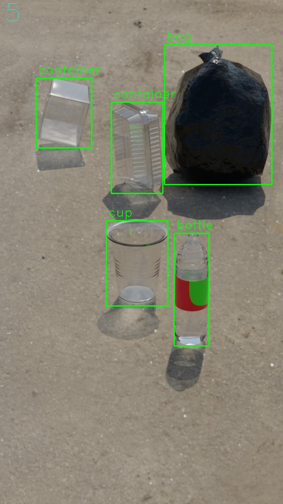

# Synthetic Dataset Blender

Render a dataset for object detection with YOLO format.

Example:




## Table of Contents
- [Stack](#stack)
- [Requirements](#requirements)
- [Clone repo](#clone-repo)
- [Set up blender](#set-up-blender)
   - [Download file](#download-file)
   - [Set render engine](#set-render-engine)
- [Set up python files](#set-up-python-files)
   - [data.py](#datapy)
   - [executer.py](#executerpy)
- [Run](#run)

## Stack

  


## Requirements
- Python
- Blender (for windows in the default location)
- A folder with many hdri or exr files

## Clone repo
```bash
git clone  https://github.com/rogerramosruiz/synthetic-dataset-blender-hdri.git
cd  synthetic-dataset-blender-hdri
```

## Set up Blender 
### Download file 
Download the next file and place it in this project folder

https://media.githubusercontent.com/media/rogerramosruiz/blender-files/main/plastic_hdri.blend


### Set render engine
- Development: it's recomended to use Eveee engine
- Dataset generations: Use Cycles engine with GPU

## Set up python files

### data.py
In data.py edit this variables

```python
# Location to save the dataset, must be full path
save_dir          = 'D:/dataset_shyntethic_hdri'
# Location of the hdri images, must be full path
hdris_dir         = 'D:/hdri_images'
```

OPTIONAL: data.py contains other variables used in the render process

### executer.py
In executer.py edit the next variable

```python
# Images to render per class
images_per_classs = 1000
```

If the next error happens when running
```
Error: System is out of GPU and shared host memory
``` 
Lower the next value
```python
# images to render per execution
max_imgs = 100
```

## Run 
Windows 
```powershell
python executer.py
```
Linux
```bash
python3 executer.py
```

Watch the progress in progress.txt